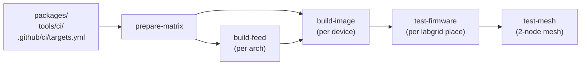
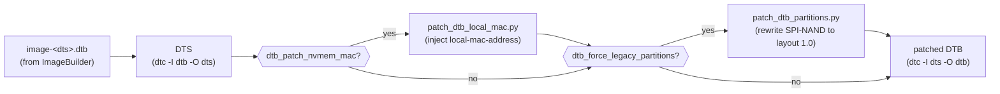

# Firmware build pipeline

End-to-end overview of how `.github/workflows/build-firmware.yml` turns
the `packages/` source tree into bootable LibreMesh artefacts and runs
them on real hardware in the fcefyn testbed.

## Pipeline at a glance



Each block is a separate GitHub Actions job. `prepare-matrix` reads
`targets.yml` and emits three matrices (one for the per-arch feed
build, one for the per-device image build, one for the per-place
hardware tests) so every leaf job runs in parallel.

## Components

| File | Role |
| --- | --- |
| [`.github/ci/targets.yml`](../../.github/ci/targets.yml) | Source of truth for the device matrix: profile, arch, FIT metadata, labgrid places, per-target package overrides. The legend at the top of the file documents every key. |
| [`.github/workflows/build-firmware.yml`](../../.github/workflows/build-firmware.yml) | Orchestrator. Computes matrices, drives the four jobs, handles caching and artifact upload/download. |
| [`tools/ci/build_feed.sh`](../../tools/ci/build_feed.sh) | Local reproducer of the CI feed build. Wraps `openwrt/gh-action-sdk@v9` to compile every `packages/<pkg>/Makefile` into `.ipk`s for one OpenWrt arch. The CI uses the upstream action directly, but this script is the canonical local equivalent. |
| [`tools/ci/build_image.sh`](../../tools/ci/build_image.sh) | Runs the OpenWrt ImageBuilder against the pre-built lime_packages feed, then repacks the resulting `*-kernel.bin` + DTB + LibreMesh CPIO into a RAM-bootable FIT (`*-initramfs-libremesh.itb`) via `mkimage` and `mkits.sh`. |
| [`tools/ci/patch_dtb_local_mac.py`](../../tools/ci/patch_dtb_local_mac.py) | Workaround for [openwrt#22858](https://github.com/openwrt/openwrt/issues/22858) on boards whose factory MAC lives in a UBI volume (Belkin RT3200): rewrites the FIT-shipped DTB to inject `local-mac-address` so `mtk_eth_soc.probe()` does not perpetually `-EPROBE_DEFER`. Gated by `dtb_patch_nvmem_mac:` in `targets.yml`. |
| [`tools/ci/patch_dtb_partitions.py`](../../tools/ci/patch_dtb_partitions.py) | Workaround for the Belkin RT3200 layout-1.0 KOD: rewrites the FIT-shipped DTB to declare the legacy 23.05 SPI-NAND partitioning (`bl2`+`fip`+`factory`+`ubi` separate MTD partitions) so a 24.10 kernel does not attach UBI over the on-flash BL31/FIP region and brick the device on the next power cycle. Gated by `dtb_force_legacy_partitions:` in `targets.yml`. Full diagnosis in [`docs/followups/belkin_rt3200_layout_1_0_dtb_patch.md`](../followups/belkin_rt3200_layout_1_0_dtb_patch.md). |

The artifact names downstream consumers expect are
`firmware-<device>.itb` (the bootable image) plus
`firmware-<device>.manifest` (the LibreMesh package list, used by
`test-firmware` to confirm the booted image is actually LibreMesh).

## Image format

Only one format is in active use: **`fit`** — a single
`*-initramfs-libremesh.itb` containing kernel + DTB + CPIO under one
configuration node, with bootargs embedded in the FIT config. Every
device currently in the matrix runs a U-Boot ≥2018 with `CONFIG_FIT=y`,
so this is the simplest path that works.

Targets whose U-Boot cannot consume a FIT (e.g. the LibreRouter v1's
QCA9558 U-Boot 1.1.x fork) are intentionally **not** in the matrix —
see [`docs/followups/imagebuilder_initramfs_limitations.md`](../followups/imagebuilder_initramfs_limitations.md).

## Caching

One actions/cache entry, scoped to the LibreMesh package sources:

```
key:           lime-feed-v2-${arch}-${openwrt_release}-${feed_hash}
restore-keys:  lime-feed-v2-${arch}-${openwrt_release}-
path:          feed-artifact/lime_packages
```

`feed_hash` is computed in `prepare-matrix` over
`packages/**/{Makefile,files,patches,src}` and `tools/ci/build_feed.sh`
only. **Edits to `targets.yml` or to `build-firmware.yml` itself do
NOT invalidate the cache** — they affect ImageBuilder package selection
and CI orchestration, not the produced `.ipk`s. This used to cause a
full ~50-min SDK rebuild on every workflow tweak.

A cold cache run takes ~15 min for `build-feed` (per arch) and ~5 min
for `build-image` (per device); a warm-cache run skips the SDK compile
entirely and goes straight to ImageBuilder.

## Devices in the build matrix

| `device` | profile | arch | hardware (labgrid place) |
| --- | --- | --- | --- |
| `linksys_e8450` | `linksys_e8450-ubi` | `aarch64_cortex-a53` | Belkin RT3200 ×3 (`belkin_rt3200_1`/`_2`/`_3`) |
| `openwrt_one` | `openwrt_one` | `aarch64_cortex-a53` | OpenWrt One (`openwrt_one`) |
| `bananapi_bpi-r4` | `bananapi_bpi-r4` | `aarch64_cortex-a53` | BananaPi BPi-R4 (`bananapi_bpi-r4`) |

The `linksys_e8450` build artefact is exercised on three physical
Belkin units in parallel, so the test-firmware matrix expands to 5
hardware-test jobs even though only 3 image-build jobs run.

WiFi 7 is currently disabled on `bananapi_bpi-r4` due to upstream
mt7996e instability — see the long comment on that target in
`targets.yml` for the rationale and the upstream tracking issue.

## Devices NOT in the build matrix

- `librerouter_librerouter-v1` (ath79/generic, MIPS) — ImageBuilder
  cannot produce a RAM-bootable LibreMesh image for this board, and
  every alternative we prototyped (multi-uimage repack, OpenWrt SDK,
  full source build) was rejected for cost/maintenance reasons. The
  labgrid YAML at
  [`libremesh-tests/targets/librerouter_librerouter-v1.yaml`](https://github.com/fcefyn-testbed/libremesh-tests/blob/staging/targets/librerouter_librerouter-v1.yaml)
  is preserved for manual local runs against a pre-staged
  `*-initramfs-kernel.bin`. Full analysis:
  [`docs/followups/imagebuilder_initramfs_limitations.md`](../followups/imagebuilder_initramfs_limitations.md).

## Running the workflow manually

The workflow has a `workflow_dispatch` trigger with two optional inputs:

- `targets` (default `all`): comma-separated list of `device:` names
  from `targets.yml` (e.g. `openwrt_one,bananapi_bpi-r4`).
- `openwrt_release` (default empty): override the release pinned in
  `targets.yml`. Useful for testing a release bump without editing the
  file.

```sh
gh workflow run build-firmware.yml \
  -f targets=openwrt_one \
  -f openwrt_release=24.10.6
```

PRs trigger the workflow automatically when any of the watched paths
change (`packages/**`, `tools/ci/build_*.sh`,
`tools/ci/patch_dtb_*.py`, `.github/ci/targets.yml`,
`.github/workflows/build-firmware.yml`).

## DTB patches applied to the FIT

Every FIT-shipped DTB goes through up to two textual patches before
recompilation; both are gated per-target in `targets.yml` and either
may be off:



Both patches share the same `dtc` round-trip (decompile -> text edit
-> recompile) and are invoked in series inside `build_image.sh`.
Stage ordering matters: the partitioning rewrite refers to factory
nvmem-cell labels that the local-mac patch leaves alone, so running
local-mac first is safe and any future patch should keep this order
or document why it diverges.

Skipping both patches keeps the original ImageBuilder DTB untouched
(the `dtc` round-trip is also skipped). That is the path
`openwrt_one` and `bananapi_bpi-r4` take today.
