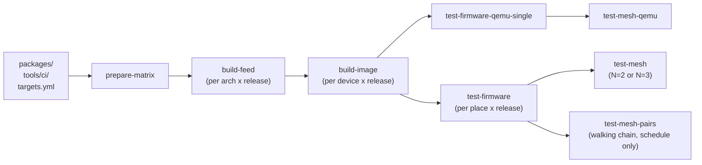
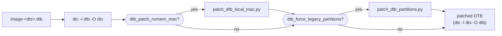
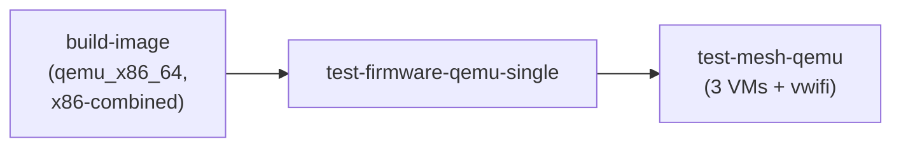
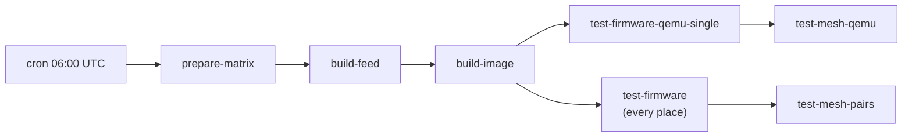

# Firmware build pipeline

`build-firmware.yml` is the **single source of truth** for active CI in this
project. It compiles the `packages/` tree into LibreMesh firmware and runs it
on QEMU and on the fcefyn lab. `fcefyn-testbed/libremesh-tests` only ships
`formal.yml` (Python lint) plus the pytest suites this workflow checks out at
runtime.

## Trigger matrix

| Trigger | Auto runs | Gated by `physical-lab` approval |
| --- | --- | --- |
| `pull_request` (paths under `packages/`, `tools/ci/**`, `targets.yml`, this workflow) | `build-feed`, `build-image`, `test-firmware-qemu-single`, `test-mesh-qemu` | `test-firmware` (1 random place, **3-node** `test-mesh`) |
| `workflow_dispatch` (manual) | same as PR | `test-firmware` if `physical_single=true`, `test-mesh` if `physical_mesh_count` is `2` or `3` |
| `schedule` (cron 06:00 UTC, daily) | same as PR plus `test-firmware` (every active place) and `test-mesh-pairs` (walking chain) | none — daily is unattended by design |

The `physical-lab` GitHub Environment is configured with required reviewers in
the repo Settings UI. One approval per workflow run releases every gated job.

## Pipeline at a glance



`test-mesh` and `test-mesh-pairs` **wait for `test-firmware` to finish**: both
reserve the same labgrid places, so running them in parallel races on the lock
(`labgrid-client: error: You have already acquired this place`).

## Matrices

`prepare-matrix` reads `targets.yml` and emits seven JSON matrices:

| Output | Consumer | What it carries |
| --- | --- | --- |
| `archs_matrix` | `build-feed` | unique `(arch × release)` cells with merged `extra_feeds` / `extra_packages` |
| `targets_matrix` | `build-image` | `(device × release)` cells with FIT / DTB / packages metadata |
| `test_targets_matrix` | `test-firmware` | `(place × release)`, filtered by `default_physical_releases`. **On `pull_request` it is downsampled to one random entry** so a PR consumes a single lab slot; `schedule` and `workflow_dispatch -f physical_single=true` keep the full sweep |
| `mesh_test_matrix` | `test-mesh` | `(places, devices, release)` with N nodes per the trigger: `physical_mesh_count` input on `workflow_dispatch`, fixed to **N=3** on `pull_request`, empty otherwise |
| `mesh_pairs_matrix` | `test-mesh-pairs` | three fixed 2-node pairs (`schedule` only) |
| `qemu_single_matrix` / `qemu_mesh_matrix` | `test-firmware-qemu-single` / `test-mesh-qemu` | every target with `test_qemu: true` × every release. NOT filtered by `default_physical_releases` — QEMU is cheap and surfaces 25.12.2 regressions early |

## Components

| File | Role |
| --- | --- |
| [`.github/ci/targets.yml`](../../.github/ci/targets.yml) | Source of truth for the device matrix: profile, arch, FIT metadata, labgrid places, per-target package overrides. Legend at the top of the file documents every key. |
| [`.github/workflows/build-firmware.yml`](../../.github/workflows/build-firmware.yml) | Orchestrator: matrices, jobs, caching, gating. |
| [`tools/ci/build_feed.sh`](../../tools/ci/build_feed.sh) | Local reproducer of `build-feed`. Wraps `openwrt/gh-action-sdk@v9` to compile `packages/<pkg>/Makefile` into IPK/APK for one OpenWrt arch. |
| [`tools/ci/build_image.sh`](../../tools/ci/build_image.sh) | Runs the OpenWrt ImageBuilder against the pre-built lime_packages feed and repacks the result into a RAM-bootable FIT (`*-initramfs-libremesh.itb`) or x86-combined image. |
| [`tools/ci/patch_dtb_local_mac.py`](../../tools/ci/patch_dtb_local_mac.py) | Workaround for [openwrt#22858](https://github.com/openwrt/openwrt/issues/22858): injects `local-mac-address` into the FIT-shipped DTB. Gated by `dtb_patch_nvmem_mac:` in `targets.yml`. |
| [`tools/ci/patch_dtb_partitions.py`](../../tools/ci/patch_dtb_partitions.py) | Belkin RT3200 layout-1.0 KOD workaround (legacy SPI-NAND partitioning). Gated by `dtb_force_legacy_partitions:`. Full diagnosis in [`docs/followups/belkin_rt3200_layout_1_0_dtb_patch.md`](../followups/belkin_rt3200_layout_1_0_dtb_patch.md). |

`build-image` produces `firmware-<device>.itb` (FIT image) plus
`firmware-<device>.manifest` (LibreMesh package list, used by `test-firmware`
to confirm the image actually carries lime-* packages). The release dimension
lives in the upload-artifact name (`firmware-<device>-<release>`), not in the
basename, so downstream test jobs glob on `firmware-<device>.<ext>` unchanged.

## Devices in the build matrix

| `device` | profile | arch | hardware (labgrid place) |
| --- | --- | --- | --- |
| `linksys_e8450` | `linksys_e8450-ubi` | `aarch64_cortex-a53` | Belkin RT3200 ×3 (`belkin_rt3200_1`/`_2`/`_3`) |
| `openwrt_one` | `openwrt_one` | `aarch64_cortex-a53` | OpenWrt One |
| `bananapi_bpi-r4` | `bananapi_bpi-r4` | `aarch64_cortex-a53` | BananaPi BPi-R4 (Wi-Fi 7 disabled — see `targets.yml` for upstream mt7996e tracking) |
| `qemu_x86_64` | `generic` (x86-64) | `x86_64` | none — runs on GitHub-hosted Linux runner with QEMU |

`linksys_e8450` is exercised on three physical Belkin units in parallel, so
`test_targets_matrix` expands to 5 lab jobs on a daily run (3 Belkin +
openwrt_one + bpi-r4) even though `build-image` produces only 3 device
artifacts × 2 releases.

### Devices NOT in the build matrix

`librerouter_librerouter-v1` (ath79/MIPS) is excluded — ImageBuilder cannot
produce a RAM-bootable LibreMesh image and every alternative we prototyped
(multi-uimage repack, OpenWrt SDK, full source build) was rejected for
cost/maintenance reasons. Full analysis:
[`docs/followups/imagebuilder_initramfs_limitations.md`](../followups/imagebuilder_initramfs_limitations.md).
The labgrid YAML at
[`libremesh-tests/targets/librerouter_librerouter-v1.yaml`](https://github.com/fcefyn-testbed/libremesh-tests/blob/staging/targets/librerouter_librerouter-v1.yaml)
remains for manual local runs against a pre-staged
`*-initramfs-kernel.bin`.

## OpenWrt releases

| `openwrt_release` | feed_branch | physical lab | notes |
| --- | --- | --- | --- |
| `24.10.6` | `openwrt-24.10` | yes | Shipping stable LibreMesh line. Default for both `openwrt_releases` and `default_physical_releases`. |
| `25.12.2` | `openwrt-25.12` | no (build-only smoke) | OpenWrt 25.12 dropped opkg in favour of [apk-tools](https://gitlab.alpinelinux.org/alpine/apk-tools). The pipeline bifurcates on `OPENWRT_RELEASE` (`PKG_FORMAT=ipk` for 24.10.x, `PKG_FORMAT=apk` for 25.12+) — `build_image.sh` emits a different `repositories` snippet, runs a format-specific pre-flight, and passes `APK_FLAGS="--allow-untrusted ..."` to `make image` for apk. Override `physical_releases` in `workflow_dispatch` to enrol 25.12.2 in the lab once a few green runs validate it. |

Adding/removing a release means editing the top of `targets.yml`:

```yaml
openwrt_releases:
  - "24.10.6"
  - "25.12.2"
feed_branches:
  "24.10.6": "openwrt-24.10"
  "25.12.2": "openwrt-25.12"
default_physical_releases:
  - "24.10.6"
```

`prepare-matrix` cross-validates that every entry in `openwrt_releases` has a
matching `feed_branches[<release>]` and aborts with an explicit error
otherwise — a dropped feed mapping would silently route the local feed
against the wrong upstream branch.

## Caching

### Feed cache (`build-feed`)

```
key:           lime-feed-v3-${arch}-${openwrt_release}-${feed_hash}-${extra_hash}
restore-keys:  lime-feed-v3-${arch}-${openwrt_release}-${feed_hash}-
path:          feed-artifact/lime_packages
```

`feed_hash` is a sha256 over `packages/**/{Makefile,files,patches,src}` and
`tools/ci/build_feed.sh`. **Edits to `targets.yml` or to the workflow itself
do NOT invalidate the cache** — they affect orchestration, not produced IPKs.

`extra_hash` is a 12-char sha256 prefix over the de-duplicated `extra_feeds` /
`extra_packages` for the cell. Bumping the feed pin in `targets.yml` busts
the cache for the affected cells only.

The `^<rev>` suffix in any `extra_feeds:` entry MUST be a **full 40-char SHA**.
OpenWrt's `scripts/feeds` resolves it via `git fetch origin <rev>` and GitHub
only honours fetch-by-SHA on full-length object names. Always pin with
`git ls-remote` output.

A cold build is ~15 min for `build-feed` and ~5 min for `build-image`; a warm
cache skips the SDK compile entirely.

### vwifi-server cache (`test-mesh-qemu`)

```
key:  vwifi-server-4a9842e6-${runner.os}
path: ~/.vwifi-server-bin
```

The QEMU mesh job clones `Raizo62/vwifi@4a9842e6` (release v7.0, July 2025)
and runs `cmake --build` to produce host binaries. The ~30 s cold build is
amortized across runs; bumping the pin in `build-firmware.yml` invalidates
the cache via the commit fragment in the key.

## Image format

Only one format is in active use: **`fit`** — a single
`*-initramfs-libremesh.itb` containing kernel + DTB + CPIO under one config
node, with bootargs embedded in the FIT config. Every device currently in the
matrix runs U-Boot ≥ 2018 with `CONFIG_FIT=y`.

The `qemu_x86_64` target uses `IMAGE_FORMAT=x86-combined` (raw
`*-x86-64-generic-ext4-combined.img.gz` with GRUB + kernel + ext4 rootfs in
one MBR blob). `BUILD_INITRAMFS=1` is incompatible with `x86-combined` and
the build script aborts with an explicit error if both are set.

### DTB patches applied to the FIT

Every FIT-shipped DTB goes through up to two textual patches before
recompilation; both are gated per-target in `targets.yml` and either may be
off:



Stage ordering matters: the partitioning rewrite refers to factory nvmem-cell
labels that the local-mac patch leaves alone, so running local-mac first is
safe. Skipping both patches keeps the original ImageBuilder DTB untouched
(`openwrt_one` and `bananapi_bpi-r4` take this path today).

## QEMU pipeline (virtual mesh build and test)

`qemu_x86_64` compiles a x86-64 LibreMesh image that CI exercises in QEMU on
a GitHub-hosted runner — no lab time, no TFTP, no DTB patches.



Two new keys in `targets.yml` drive the QEMU integration:

- **`extra_feeds`** — list of `<type>|<name>|<url>[^<commit>]` strings
  appended to gh-action-sdk's `feeds.conf`. Today `qemu_x86_64` uses this for
  `vwifi`, pointing at `fcefyn-testbed/vwifi_cli_package` (our fork that adds
  the missing `PKG_MIRROR_HASH`).
- **`extra_packages`** — list of package names that the SDK should build from
  the extra feeds. Local packages under `packages/` are auto-discovered; only
  external feed packages need to be listed (today: `[vwifi]`).

The assemble step searches each `extra_packages` entry under both
`bin/packages/<arch>/<feedname>/` and `bin/targets/<target>/<subtarget>/packages/`
(SDK output split). The trees are merged into `feed-artifact/lime_packages/`
so ImageBuilder installs everything through the single `lime_packages_local`
feed.

### `test-firmware-qemu-single`

Per `(qemu device, openwrt_release)` cell:

1. Download `firmware-qemu_x86_64-<release>` artefact.
2. `apt-get install qemu-system-x86 ovmf`.
3. Check out `fcefyn-testbed/libremesh-tests@staging`, `uv sync`.
4. `pytest tests/test_libremesh.py tests/test_base.py tests/test_lan.py
   --lg-env targets/qemu_x86-64_libremesh.yaml --firmware fw/firmware-qemu_x86_64.img`.

The labgrid env boots the image, polls dropbear on the guest's anygw
(`10.13.0.1:22`) and forwards SSH there. KVM is enabled via a udev rule
because GitHub-hosted runners ship `/dev/kvm` mode `0660`; the launcher's
`_vm_has_kvm()` probes `os.access` so it falls back to TCG cleanly when the
device is unavailable.

### `test-mesh-qemu`

Spawns 3 QEMU instances of the same image and ties them through `vwifi-server`
so 802.11s-over-`mac80211_hwsim` forms a real mesh on the host loopback:

1. Restore (or build) `vwifi-server` from `Raizo62/vwifi@4a9842e6`.
2. Apt-install QEMU + cmake + build-essential + libnl deps.
3. Check out libremesh-tests, `uv sync`.
4. Download the firmware artefact.
5. Start `vwifi-server -u` in the background.
6. `LG_VIRTUAL_MESH=1 VIRTUAL_MESH_NODES=3 VIRTUAL_MESH_IMAGE=fw/firmware-qemu_x86_64.img
   pytest tests/test_mesh.py`.

`LG_VIRTUAL_MESH=1` flips the `mesh_nodes` fixture in
[`libremesh-tests/tests/conftest_mesh.py`](https://github.com/fcefyn-testbed/libremesh-tests/blob/staging/tests/conftest_mesh.py)
from the labgrid path to
[`virtual_mesh_launcher.launch_virtual_mesh()`](https://github.com/fcefyn-testbed/libremesh-tests/blob/staging/scripts/virtual_mesh_launcher.py),
which spawns N VMs with user-mode networking and configures `vwifi-client`
per VM via SSH. Setup details in
[`docs/followups/qemu_vwifi_ci.md`](../followups/qemu_vwifi_ci.md).

## Physical lab pipeline

Three triggers reach the lab. They share the `physical-lab-shared`
workflow-level concurrency group so two lab-bound runs never reserve the same
place at once.

### Daily smoke (`schedule`)



`test-firmware` sweeps every active place; on completion `test-mesh-pairs`
runs three sequential 2-node pairs (`max-parallel: 1`):

| # | place_a | place_b | Coverage |
| --- | --- | --- | --- |
| 1 | `belkin_rt3200_2` | `openwrt_one` | mt7622 ↔ filogic (cross-arch) |
| 2 | `openwrt_one` | `bananapi_bpi-r4` | filogic ↔ filogic |
| 3 | `bananapi_bpi-r4` | `belkin_rt3200_3` | filogic ↔ mt7622 |

Every active device gets at least two mesh validations per day; pairs cross
arch boundaries so a SoC-specific regression surfaces in two pairs.
`belkin_rt3200_1` is excluded (in repair as of May 2026). The cron run does
NOT use environment approval — the lab is dedicated and a 03:00 ART run
cannot wait for a reviewer.

### Pull-request gate (`pull_request`)

PRs trigger build-feed, build-image, and both QEMU jobs automatically. The
physical jobs (`test-firmware`, `test-mesh`) appear as **"Waiting for
review"** in the run UI; a maintainer approves via the `physical-lab`
environment to release them. The PR-specific shape:

| Job | What runs on PR | Why |
| --- | --- | --- |
| `test-firmware` | one **random** place from the active matrix | bounded approval cost; full sweep stays available daily / via dispatch |
| `test-mesh` | **N=3** (openwrt_one + bananapi_bpi-r4 + belkin_rt3200_2) | full cross-arch routing surface; PR cannot pass a UI dropdown like dispatch can |

`test-mesh` waits for `test-firmware` to finish (lock serialization) — the
maintainer approves the environment **once per run** and both jobs proceed
in order.

### Manual dispatch (`workflow_dispatch`)

Maintainer triggers from the Actions tab ("Build firmware" → "Run workflow").
Inputs:

| Input | Default | Effect |
| --- | --- | --- |
| `targets` | `all` | comma-separated list of `device:` names from `targets.yml` |
| `openwrt_releases` | (from `targets.yml`) | comma-separated list of releases to build |
| `physical_releases` | (`default_physical_releases`) | comma-separated list of releases to test on the lab |
| `physical_single` | `false` | run `test-firmware` against every active place |
| `physical_mesh_count` | `0` | `0` = skip, `2` = openwrt_one + bpi-r4, `3` = those two + belkin_rt3200_2 |

```sh
# Build a single device + release for fast iteration. No lab.
gh workflow run build-firmware.yml -f targets=openwrt_one -f openwrt_releases=24.10.6

# Single-node smoke on every active lab device (5 jobs).
gh workflow run build-firmware.yml -f physical_single=true

# Mesh-only run with 3 nodes for a routing regression check.
gh workflow run build-firmware.yml -f physical_mesh_count=3

# Pre-merge full physical coverage for a risky branch.
gh workflow run build-firmware.yml -f physical_single=true -f physical_mesh_count=3

# Enrol 25.12.2 in the lab too.
gh workflow run build-firmware.yml -f physical_releases=24.10.6,25.12.2
```

`workflow_dispatch` runs in the context of the branch you select in the UI
(default `master`), so this also covers post-merge sanity / replaying a
transient lab failure when the cron itself cannot be re-fired.

### When to opt into physical (PR or dispatch)

The QEMU jobs cover ~80% of the regression surface — anything touching
`lime-config`, batman-adv routing, babeld convergence, LAN/SSH integration,
or default packaging passes through the virtual mesh. Reach for the lab for:

- Changes to `tools/ci/build_image.sh` repack logic (FIT assembly, DTB
  patches, image format selection).
- Changes to `tools/ci/patch_dtb_*.py`.
- Anything touching the `targets.yml` fields read at boot (`fit_arch`,
  `fit_kernel_loadaddr`, `fit_dts`, `fit_config`, `fit_bootargs`,
  `dtb_patch_nvmem_mac`, `dtb_force_legacy_partitions`).
- Real-radio Wi-Fi changes (mt7986e, mt7996e driver bumps; vwifi cannot
  exercise these).
- Pre-merge sanity for a release rotation (e.g. enabling 25.12.2 in
  `default_physical_releases`).

For everything else (package version bumps, lime-* refactors, docs, CI
orchestration) the QEMU coverage is sufficient and the maintainer simply
declines the `physical-lab` approval; the daily cron picks up routine drift
the next morning anyway.

### One-time setup of the `physical-lab` environment

Configured in the GitHub repo Settings UI (CI cannot create it
programmatically):

1. Settings → Environments → "New environment", name **`physical-lab`** (the
   workflow references this exact string).
2. **Required reviewers**: every maintainer authorised to spend lab time
   (today: Javier and the fcefyn-testbed admins). Multiple reviewers are
   OR'd by default.
3. **Deployment branches**: leave at "All branches" — the gate is on the
   reviewer, not on the branch.
4. **Wait timer**: 0 (the workflow finishes building QEMU artefacts in ~6-8
   min, which is the implicit wait already).
5. **Environment secrets / variables**: none — the lab credentials live on
   the self-hosted runner.

Once saved, every job that declares `environment: physical-lab` pauses for
approval before scheduling, with a "Review required" banner on the run page.
One approval per workflow run releases all gated jobs. The pause does not
consume a self-hosted runner slot — jobs queue at the GitHub side.

We considered a `pull_request_target` + `labeled` event so adding a
`ci:physical` label would auto-fire the lab; we rejected it because
`pull_request_target` runs in the trusted context of the target repo and
combining it with `actions/checkout` of the PR's SHA is a known foot-gun
(any code in the PR including `tools/ci/` would execute with write tokens).
The approval-gated `pull_request` path keeps the human review explicit
without exposing trusted tokens to PR code.
