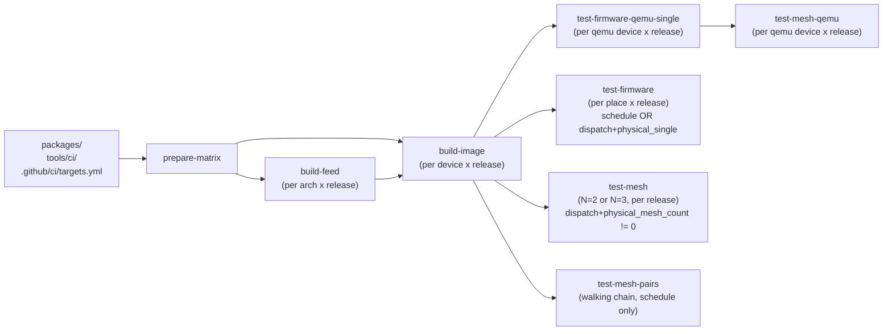
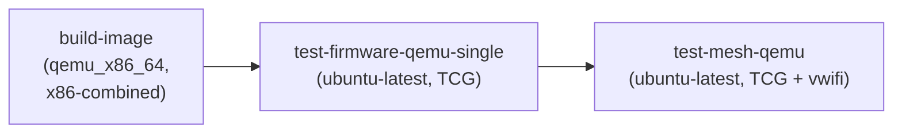
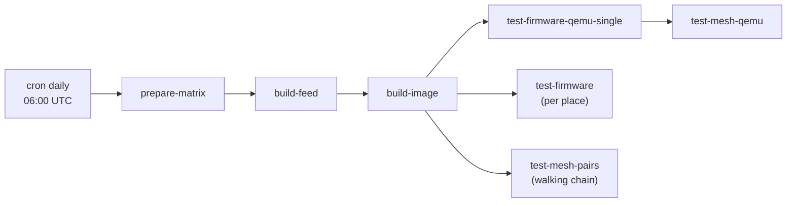
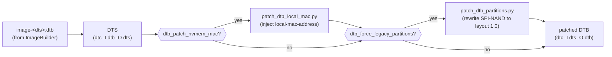

# Firmware build pipeline

End-to-end overview of how `.github/workflows/build-firmware.yml` turns
the `packages/` source tree into bootable LibreMesh artefacts and runs
them on QEMU and on real hardware in the fcefyn testbed.

`build-firmware.yml` is the **single source of truth** for active CI
in this project. It runs on three triggers:

| Trigger | What runs | Lab? |
| --- | --- | --- |
| `pull_request` to `master`/`main` | build-feed + build-image + QEMU single-node + QEMU mesh | no |
| `workflow_dispatch` | the same plus optional opt-in physical jobs (gated on `physical-lab` environment approval) | only if maintainer opts in via inputs |
| `schedule` (cron 06:00 UTC, daily) | the same plus physical `test-firmware` (single-node per device) and `test-mesh-pairs` (walking chain of three 2-node pairs) | yes, unattended (no environment approval; lab is dedicated) |

`fcefyn-testbed/libremesh-tests` no longer ships its own
daily/PR workflows — the active CI is centralized here. That
repository keeps `formal.yml` (Python lint + cross-version `uv sync`)
and ships the pytest suites and labgrid envs that this workflow
checks out at runtime. See the trade-off discussion in the project
TFG (chapter 4 → "CI architecture").

## Pipeline at a glance



Each block is a separate GitHub Actions job. `prepare-matrix` reads
`targets.yml` and emits seven matrices:

- `archs_matrix` — one cell per `(arch, openwrt_release)` for the
  per-toolchain SDK build. Sharing the same arch across releases
  produces distinct IPKs (different libc/gcc), so each cell runs its
  own `gh-action-sdk` job and uploads its own `lime-feed-<arch>-<release>`
  artifact. Cells whose targets declare `extra_feeds:` propagate the
  entries to the SDK build's `EXTRA_FEEDS` env var; `extra_packages:`
  get appended to `PACKAGES`. Today `qemu_x86_64` uses this for
  `vwifi` (from `fcefyn-testbed/vwifi_cli_package`, our fork that
  adds `PKG_MIRROR_HASH`; pending upstream PR to `javierbrk`).
- `targets_matrix` — one cell per `(device, openwrt_release)` for the
  per-device ImageBuilder run. Each cell pulls the matching
  `lime-feed-*-<release>` artifact and emits a
  `firmware-<device>-<release>` artifact.
- `test_targets_matrix` — `(place, release)` cells filtered by
  `default_physical_releases` in `targets.yml` (which today restricts
  the lab to 24.10.6, leaving 25.12.2 build-only). Consumed by
  `test-firmware` on `schedule` (daily) and on `workflow_dispatch`
  with `physical_single=true`.
- `mesh_test_matrix` — `(places, devices, release)` cell shape that
  encodes the maintainer-selected number of physical nodes for the
  manual mesh test (`physical_mesh_count` input: `0`, `2`, or `3`).
  Empty when the input is `0`. Consumed by `test-mesh` only on
  `workflow_dispatch`.
- `mesh_pairs_matrix` — fixed walking-chain matrix used by
  `test-mesh-pairs` on `schedule` only. Three 2-node pairs cover
  every active lab device (excludes `belkin_rt3200_1`, in repair).
  Empty when `physical_releases_json` is empty.
- `qemu_single_matrix` — one cell per `(device, openwrt_release)`
  whose target declared `test_qemu: true` in `targets.yml`. Drives
  the GitHub-hosted QEMU single-node smoke job. NOT filtered by
  `default_physical_releases`: QEMU validation runs on every
  supported release because it is cheap and surfaces 25.12.2
  regressions earlier than waiting for the lab.
- `qemu_mesh_matrix` — same shape as `qemu_single_matrix` today;
  drives the multi-node QEMU+vwifi mesh job. Kept as a separate
  output so a future split (different node-count per device, or
  different runner pool) is a `prepare-matrix` change only.

So every leaf job runs in parallel across both the device and the
release axis.

## Components

| File | Role |
| --- | --- |
| [`.github/ci/targets.yml`](../../.github/ci/targets.yml) | Source of truth for the device matrix: profile, arch, FIT metadata, labgrid places, per-target package overrides. The legend at the top of the file documents every key. |
| [`.github/workflows/build-firmware.yml`](../../.github/workflows/build-firmware.yml) | Orchestrator. Computes matrices, drives the four jobs, handles caching and artifact upload/download. |
| [`tools/ci/build_feed.sh`](../../tools/ci/build_feed.sh) | Local reproducer of the CI feed build. Wraps `openwrt/gh-action-sdk@v9` to compile every `packages/<pkg>/Makefile` into `.ipk`s for one OpenWrt arch. The CI uses the upstream action directly, but this script is the canonical local equivalent. |
| [`tools/ci/build_image.sh`](../../tools/ci/build_image.sh) | Runs the OpenWrt ImageBuilder against the pre-built lime_packages feed, then repacks the resulting `*-kernel.bin` + DTB + LibreMesh CPIO into a RAM-bootable FIT (`*-initramfs-libremesh.itb`) via `mkimage` and `mkits.sh`. |
| [`tools/ci/patch_dtb_local_mac.py`](../../tools/ci/patch_dtb_local_mac.py) | Workaround for [openwrt#22858](https://github.com/openwrt/openwrt/issues/22858) on boards whose factory MAC lives in a UBI volume (Belkin RT3200): rewrites the FIT-shipped DTB to inject `local-mac-address` so `mtk_eth_soc.probe()` does not perpetually `-EPROBE_DEFER`. Gated by `dtb_patch_nvmem_mac:` in `targets.yml`. |
| [`tools/ci/patch_dtb_partitions.py`](../../tools/ci/patch_dtb_partitions.py) | Workaround for the Belkin RT3200 layout-1.0 KOD: rewrites the FIT-shipped DTB to declare the legacy 23.05 SPI-NAND partitioning (`bl2`+`fip`+`factory`+`ubi` separate MTD partitions) so a 24.10 kernel does not attach UBI over the on-flash BL31/FIP region and brick the device on the next power cycle. Gated by `dtb_force_legacy_partitions:` in `targets.yml`. Full diagnosis in [`docs/followups/belkin_rt3200_layout_1_0_dtb_patch.md`](../followups/belkin_rt3200_layout_1_0_dtb_patch.md). |

The artifact names downstream consumers expect are
`firmware-<device>.itb` (the bootable image, packaged INSIDE the
upload-artifact named `firmware-<device>-<openwrt_release>`) plus
`firmware-<device>.manifest` (the LibreMesh package list, used by
`test-firmware` to confirm the booted image is actually LibreMesh).
The release dimension lives in the artifact name, not in the file
basename, so downstream test jobs reuse the legacy
`firmware-<device>.<ext>` glob unchanged.

## Image format

Only one format is in active use: **`fit`** — a single
`*-initramfs-libremesh.itb` containing kernel + DTB + CPIO under one
configuration node, with bootargs embedded in the FIT config. Every
device currently in the matrix runs a U-Boot ≥2018 with `CONFIG_FIT=y`,
so this is the simplest path that works.

Targets whose U-Boot cannot consume a FIT (e.g. the LibreRouter v1's
QCA9558 U-Boot 1.1.x fork) are intentionally **not** in the matrix —
see [`docs/followups/imagebuilder_initramfs_limitations.md`](../followups/imagebuilder_initramfs_limitations.md).

## Caching

Two actions/cache entries are in play.

### Feed cache (`build-feed`)

```
key:           lime-feed-v3-${arch}-${openwrt_release}-${feed_hash}-${extra_hash}
restore-keys:  lime-feed-v3-${arch}-${openwrt_release}-${feed_hash}-
path:          feed-artifact/lime_packages
```

`feed_hash` is computed in `prepare-matrix` over
`packages/**/{Makefile,files,patches,src}` and `tools/ci/build_feed.sh`
only. **Edits to `targets.yml` or to `build-firmware.yml` itself do
NOT invalidate the cache** — they affect ImageBuilder package selection
and CI orchestration, not the produced `.ipk`s. This used to cause a
full ~50-min SDK rebuild on every workflow tweak.

`extra_hash` is a 12-char sha256 prefix over the (de-duplicated)
`extra_feeds` and `extra_packages` strings for that arch+release
cell. Bumping the feed pin in `targets.yml` (e.g. when
`javierbrk/vwifi_cli_package` merges our PR and we switch the URL
back to upstream) busts the cache for the affected cells only.

The `^<rev>` suffix in any `extra_feeds:` entry MUST be a **full 40-char SHA**. OpenWrt's
`scripts/feeds` resolves it via `git fetch origin <rev>` and
GitHub's smart-HTTP server only honours fetch-by-SHA on full
40-char object names. Short prefixes (e.g. `^51bbf3bc`) make the
server reply `couldn't find remote ref 51bbf3bc` and the SDK
aborts before any IPK is built. Always pin with `git ls-remote`
output (or `git rev-parse HEAD` after a manual clone). The
`restore-keys` falls back to the same arch+release+feed_hash
without `extra_hash`, but the `actions/cache` step does NOT
promote partial matches into a "cache-hit" — the build-feed step
still recompiles when the exact key is new, so a stale extras
restore never reaches the SDK.

A cold cache run takes ~15 min for `build-feed` (per arch) and ~5 min
for `build-image` (per device); a warm-cache run skips the SDK compile
entirely and goes straight to ImageBuilder.

### vwifi-server cache (`test-mesh-qemu`)

```
key:           vwifi-server-4a9842e6-${runner.os}
path:          ~/.vwifi-server-bin
```

The QEMU mesh job clones `Raizo62/vwifi` at commit `4a9842e6`
(release v7.0, July 2025) and runs `cmake --build` to produce
`vwifi-server`/`vwifi-client`/`vwifi-ctrl` host binaries. The
~30s cold build is amortized across runs by caching the binaries
under `~/.vwifi-server-bin/`; bumping the pin in `build-firmware.yml`
invalidates the cache through the commit fragment in the key.

## Devices in the build matrix

| `device` | profile | arch | hardware (labgrid place) |
| --- | --- | --- | --- |
| `linksys_e8450` | `linksys_e8450-ubi` | `aarch64_cortex-a53` | Belkin RT3200 ×3 (`belkin_rt3200_1`/`_2`/`_3`) |
| `openwrt_one` | `openwrt_one` | `aarch64_cortex-a53` | OpenWrt One (`openwrt_one`) |
| `bananapi_bpi-r4` | `bananapi_bpi-r4` | `aarch64_cortex-a53` | BananaPi BPi-R4 (`bananapi_bpi-r4`) |
| `qemu_x86_64` | `generic` (x86-64) | `x86_64` | none — runs on GitHub-hosted Linux runner with QEMU/TCG; see [QEMU pipeline](#qemu-pipeline-virtual-mesh-build-and-test) below |

The `linksys_e8450` build artefact is exercised on three physical
Belkin units in parallel, so for the default
`default_physical_releases: [24.10.6]` the test-firmware matrix expands
to 5 hardware-test jobs (3 Belkin + openwrt_one + bpi-r4) even though
6 image-build jobs run (3 devices × 2 releases).

WiFi 7 is currently disabled on `bananapi_bpi-r4` due to upstream
mt7996e instability — see the long comment on that target in
`targets.yml` for the rationale and the upstream tracking issue.

## OpenWrt releases in the build matrix

| `openwrt_release` | feed_branch | physical lab | notes |
| --- | --- | --- | --- |
| `24.10.6` | `openwrt-24.10` | yes | Shipping stable LibreMesh line. Default for both `openwrt_releases` and `default_physical_releases` in `targets.yml`. |
| `25.12.2` | `openwrt-25.12` | no (build-only smoke) | OpenWrt 25.12 dropped opkg in favour of [apk-tools](https://gitlab.alpinelinux.org/alpine/apk-tools). The build pipeline now bifurcates on `OPENWRT_RELEASE` (`PKG_FORMAT=ipk` for 24.10.x, `PKG_FORMAT=apk` for 25.12+) — the assemble step generates `Packages` + `Packages.gz` for ipk and `packages.adb` for apk; `tools/ci/build_image.sh` writes a different `repositories` snippet per format, runs a format-specific pre-flight, and passes `APK_FLAGS="--allow-untrusted --repository file:///feed/lime_packages/packages.adb"` to `make image` for apk. Override `physical_releases` in `workflow_dispatch` to enroll 25.12.2 in the lab once a few green build-image runs validate the new path. |

Adding or removing a release means editing the top of
`.github/ci/targets.yml`:

```yaml
openwrt_releases:
  - "24.10.6"
  - "25.12.2"
feed_branches:
  "24.10.6": "openwrt-24.10"
  "25.12.2": "openwrt-25.12"
default_physical_releases:
  - "24.10.6"
```

`prepare-matrix` cross-validates that every entry in `openwrt_releases`
has a matching `feed_branches[<release>]` and aborts the run with an
explicit error if any release is missing — a dropped feed mapping
would otherwise silently route the local feed against the wrong
upstream branch.

## Devices NOT in the build matrix

- `librerouter_librerouter-v1` (ath79/generic, MIPS) — ImageBuilder
  cannot produce a RAM-bootable LibreMesh image for this board, and
  every alternative we prototyped (multi-uimage repack, OpenWrt SDK,
  full source build) was rejected for cost/maintenance reasons. The
  labgrid YAML at
  [`libremesh-tests/targets/librerouter_librerouter-v1.yaml`](https://github.com/fcefyn-testbed/libremesh-tests/blob/staging/targets/librerouter_librerouter-v1.yaml)
  is preserved for manual local runs against a pre-staged
  `*-initramfs-kernel.bin`. Full analysis:
  [`docs/followups/imagebuilder_initramfs_limitations.md`](../followups/imagebuilder_initramfs_limitations.md).

## Running the workflow manually

The workflow has a `workflow_dispatch` trigger with five optional
inputs:

- `targets` (default `all`): comma-separated list of `device:` names
  from `targets.yml` (e.g. `openwrt_one,bananapi_bpi-r4`).
- `openwrt_releases` (default empty → uses `targets.yml`): comma-
  separated list of releases to build. Useful when narrowing the
  matrix to a single release for fast iteration on, say, a
  Belkin-specific DTB patch.
- `physical_releases` (default empty → uses
  `default_physical_releases`): comma-separated list of releases for
  which the lab jobs should run. Today this only impacts behaviour
  when 25.12.2 image builds work end-to-end and the maintainer
  wants to enroll the lab in the new branch.
- `physical_single` (boolean, default `false`): run the
  `test-firmware` lab job (single-node tests on every active lab
  place). Gated behind the `physical-lab` environment approval.
- `physical_mesh_count` (choice `0`/`2`/`3`, default `0`): how many
  physical lab nodes to spin up for the mesh test. `0` skips
  `test-mesh` entirely; `2` exercises openwrt_one + bpi-r4; `3`
  adds belkin_rt3200_2. Gated behind the `physical-lab` environment
  approval.

```sh
# Build openwrt_one only, both releases (default). No lab.
gh workflow run build-firmware.yml -f targets=openwrt_one

# Build a single release for fast iteration.
gh workflow run build-firmware.yml \
  -f targets=openwrt_one \
  -f openwrt_releases=24.10.6

# Once 25.12.2 image builds pass, enroll it in the lab too.
gh workflow run build-firmware.yml \
  -f physical_releases=24.10.6,25.12.2

# Pre-merge full physical coverage for a risky branch.
gh workflow run build-firmware.yml \
  -f physical_single=true \
  -f physical_mesh_count=3
```

PRs trigger the workflow automatically when any of the watched paths
change (`packages/**`, `tools/ci/build_*.sh`,
`tools/ci/patch_dtb_*.py`, `.github/ci/targets.yml`,
`.github/workflows/build-firmware.yml`).

## QEMU pipeline (virtual mesh build and test)

The `qemu_x86_64` target compiles a x86-64 LibreMesh image that the
CI exercises in QEMU on a GitHub-hosted runner — no lab time, no
TFTP, no DTB patches. Two test jobs consume the resulting
`firmware-qemu_x86_64-<release>.img` artefact:



`build-image` flows through the same matrix as the FIT-based targets
but takes a different `IMAGE_FORMAT` branch in
[`build_image.sh`](../../tools/ci/build_image.sh):

- `IMAGE_FORMAT=x86-combined` selects the
  `*-x86-64-generic-ext4-combined.img.gz` artefact instead of the
  `*-initramfs-libremesh.itb` FIT. The script `gunzip -k`s the gz
  in-place so downstream consumers do not need to handle compression
  at boot time, then ships the raw `.img`.
- `BUILD_INITRAMFS=1` is incompatible with `x86-combined` (the
  combined image already has GRUB + kernel + ext4 rootfs in one MBR
  blob, no FIT to repack). The script aborts with an explicit error
  if both are set.

Two new keys in `targets.yml` drive the QEMU integration:

- `extra_feeds:` — list of `<type>|<name>|<url>[^<commit>]` strings
  appended to gh-action-sdk's `feeds.conf` at build-feed time.
  `qemu_x86_64` uses this today for `vwifi`, pointing at
  `fcefyn-testbed/vwifi_cli_package` (our fork that adds the
  `PKG_MIRROR_HASH` missing in upstream; a PR to
  `javierbrk/vwifi_cli_package` is open). The `<commit>` MUST be
  a full 40-char SHA — see "Feed cache" above.
- `extra_packages:` — list of package names that the SDK should
  build from the extra feeds. Local packages under `packages/` are
  auto-discovered; only external feed packages need to be listed
  here. For `qemu_x86_64` this is `[vwifi]`. Note that
  `kmod-mac80211-hwsim` ships pre-compiled in OpenWrt's official
  kmods feed and lives in `repositories.snippet`, so it does NOT
  need to appear here.

  The assemble step searches for each `extra_packages:` IPK in two
  output trees, since the SDK splits its output by package
  architecture:

  - `bin/packages/<arch>/<feedname>/` and `bin/packages/all/<feedname>/`
    — used for `PKGARCH:=all` packages (shell scripts, lua, …),
    same place where the in-repo lime-* IPKs land.
  - `bin/targets/<target>/<subtarget>/packages/` — used for
    per-arch compiled binaries. `vwifi` (a C++ daemon built per
    arch) lands here, e.g. `bin/targets/x86/64/packages/vwifi_*.ipk`.

  Both trees are merged into the unified
  `feed-artifact/lime_packages/` so ImageBuilder can install
  everything through the single `lime_packages_local` opkg feed.
  If a declared `extra_packages:` entry produces no IPK in either
  tree, the assemble step fails with `ERROR: extra_packages entry
  '<pkg>' produced no IPK` and dumps the contents of
  `bin/targets/**/packages/` for diagnosis.

### Single-node QEMU smoke (`test-firmware-qemu-single`)

Runs on `ubuntu-latest` per `(qemu device, openwrt_release)` cell.
Steps mirror the physical `test-firmware` job:

1. Download `firmware-qemu_x86_64-<release>` artefact.
2. `apt-get install qemu-system-x86 ovmf`.
3. Check out `fcefyn-testbed/libremesh-tests@staging`, run `uv sync`.
4. `uv run pytest tests/test_libremesh.py tests/test_base.py
   tests/test_lan.py --lg-env targets/qemu_x86-64_libremesh.yaml
   --firmware fw/firmware-qemu_x86_64.img`.

The labgrid env in libremesh-tests configures a `QEMUDriver` +
`QEMUNetworkStrategyLibreMesh` that boots the image, polls dropbear
on the guest's `anygw` (10.13.0.1:22) and forwards SSH there. No
KVM is used — GitHub-hosted runners do not expose `/dev/kvm`, so
`qemu-system-x86_64` runs in TCG. Boot is ~60-90s on a cold runner.

### Multi-node QEMU mesh (`test-mesh-qemu`)

Spawns 3 QEMU instances of the same image and ties them through
`vwifi-server` so 802.11s-over-mac80211_hwsim forms a real mesh on
the host loopback:

1. Restore (or build from source) `vwifi-server` from
   `Raizo62/vwifi@4a9842e6`. See [vwifi-server cache](#vwifi-server-cache-test-mesh-qemu) above.
2. `apt-get install qemu-system-x86 ovmf cmake build-essential …`.
3. Check out libremesh-tests, run `uv sync`.
4. Download the firmware artefact.
5. Start `vwifi-server -u` in the background.
6. `LG_VIRTUAL_MESH=1 VIRTUAL_MESH_NODES=3
   VIRTUAL_MESH_IMAGE=fw/firmware-qemu_x86_64.img uv run pytest
   tests/test_mesh.py`.

The `LG_VIRTUAL_MESH=1` env var flips the `mesh_nodes` fixture in
[`libremesh-tests/tests/conftest_mesh.py`](https://github.com/fcefyn-testbed/libremesh-tests/blob/staging/tests/conftest_mesh.py)
from the labgrid path to
[`virtual_mesh_launcher.launch_virtual_mesh()`](https://github.com/fcefyn-testbed/libremesh-tests/blob/staging/scripts/virtual_mesh_launcher.py),
which spawns N VMs with user-mode networking and configures
`vwifi-client` per VM via SSH. The `pytest_collection_modifyitems`
hook in `tests/conftest.py` was extended to recognise this env var
as a valid opt-in for `mesh`-marked tests; without that fix the
QEMU mesh tests would always be skipped despite a correctly-
provisioned harness.

Setup details, troubleshooting recipes, and the open follow-ups for
hardening this path live in
[`docs/followups/qemu_vwifi_ci.md`](../followups/qemu_vwifi_ci.md).

## Daily lab validation (schedule)

The same `build-firmware.yml` is fired every day at 06:00 UTC
(03:00 ART) by a `cron` trigger. The cron run validates the
**HEAD of the default branch** end-to-end on the lab — same
build, same artefacts, same test code as a PR run. The
firmware-catalog / antennine.org daily image discovery used by the
old `health-check.yml` workflow was retired in May 2026 because:

1. Validating the **CI-built image** (not a third-party catalog
   build) is what the lab needs to certify a master commit, and
2. Running daily and PR through the **same** workflow eliminates
   drift in the build path (`tools/ci/build_image.sh`, DTB
   patchers, ImageBuilder version) between the two cadences.



What the daily exercises on the lab:

- **`test-firmware` (per place)**: every active lab device boots
  a freshly built initramfs FIT and runs the single-node
  LibreMesh suite (`tests/test_libremesh.py`). Belkin RT3200 ×3
  (`belkin_rt3200_1`/`_2`/`_3`) all share the `linksys_e8450`
  artefact under per-place TFTP staging, so a bad DTB patch
  surfaces on multiple units the same morning.
- **`test-mesh-pairs` (walking chain)**: three 2-node pairs run
  sequentially under `max-parallel: 1` (they share devices, so
  they cannot overlap):

  | # | place_a | place_b | Coverage |
  |---|---|---|---|
  | 1 | `belkin_rt3200_2` | `openwrt_one` | mt7622 ↔ filogic (cross-arch) |
  | 2 | `openwrt_one` | `bananapi_bpi-r4` | filogic ↔ filogic (intra-arch) |
  | 3 | `bananapi_bpi-r4` | `belkin_rt3200_3` | cross-arch, second Belkin unit |

  Every active device gets at least two mesh validations per day
  and the chain crosses arch boundaries so a regression specific
  to one SoC surfaces in two pairs. `belkin_rt3200_1` is
  excluded — it is in repair as of May 2026.

The daily run does NOT use the `physical-lab` environment
approval: the cron is unattended by design, and the project lab
is dedicated, so a 03:00 ART run cannot wait for a reviewer. The
`physical-lab-shared` workflow-level concurrency group serializes
the cron against any concurrent `workflow_dispatch` with
physical inputs opted in (see "Manual gating" below).

### Devices NOT covered by the daily

- `qemu_x86_64`: never reaches the lab — virtual targets run
  only on the GitHub-hosted QEMU jobs above.
- `librerouter_librerouter-v1`: not in the build matrix, so
  the daily cannot test it. See "Devices NOT in the build
  matrix" above.

### Re-running the daily on demand

```sh
# Reproduce yesterday's daily by triggering a workflow_dispatch
# with physical_single + physical_mesh_count enabled (the same
# coverage minus the walking chain — chain runs only on cron).
gh workflow run build-firmware.yml \
  -f physical_single=true \
  -f physical_mesh_count=3
```

The cron itself cannot be re-fired manually from the UI, but
`workflow_dispatch` covers every motivation for replaying it
(post-merge sanity, reproducing a transient lab failure, etc.).

## Manual gating for physical-lab tests

Hardware tests (`test-firmware` against the lab places and
`test-mesh` against an N=2 or N=3 mesh shape) are gated behind a
GitHub Environment named **`physical-lab`** when triggered by
`workflow_dispatch`. By default a PR run executes:

- The full build matrix (`build-feed` + `build-image` for every
  device × release).
- Both QEMU jobs (`test-firmware-qemu-single` + `test-mesh-qemu`)
  for fast feedback.

Physical-lab jobs run **only** when the maintainer explicitly opts
in via `workflow_dispatch` inputs (or implicitly via the daily
cron, see "Daily lab validation" above). This is the trade-off
Javier requested: keep PR feedback fast and lab-independent, but
preserve the option to validate against real hardware before
merge for risky changes (DTB patches, kernel config, anything
touching the boot path).

### When to opt in

The QEMU jobs cover ~80% of the regression surface — anything that
involves `lime-config`, batman-adv routing, babeld convergence,
LAN/SSH integration, or default packaging passes through the
virtual mesh. The remaining 20% needs lab time:

- Changes to `tools/ci/build_image.sh` repack logic (FIT
  assembly, DTB patches, image format selection).
- Changes to `tools/ci/patch_dtb_*.py`.
- Anything touching the `targets.yml` fields read at boot
  (`fit_arch`, `fit_kernel_loadaddr`, `fit_dts`, `fit_config`,
  `fit_bootargs`, `dtb_patch_nvmem_mac`,
  `dtb_force_legacy_partitions`).
- Real-radio Wi-Fi changes (OpenWrt One mt7986e or BPi-R4 mt7996e
  driver bumps; vwifi cannot exercise these).
- Pre-merge sanity for a release rotation (e.g. enabling 25.12.2
  in `default_physical_releases`).

For everything else — package version bumps, lime-* refactors,
documentation, CI orchestration tweaks — the QEMU coverage is
sufficient and the lab stays idle.

### One-time setup of the `physical-lab` environment

The environment must be created in the GitHub repository Settings
UI. CI cannot create it programmatically. The owner of the
repository walks through this once:

1. Settings → Environments → "New environment", name
   `physical-lab` (the workflow references this exact string).
2. **Required reviewers**: add every maintainer authorised to
   spend lab time. Today: Javier (thesis director) and the
   fcefyn-testbed admins. Multiple reviewers are OR'd by default
   (any one of them can approve).
3. **Deployment branches**: leave at "All branches" — the gate is
   on the human reviewer, not on the branch. PRs from forks get
   the same approval flow as PRs from feature branches.
4. **Wait timer**: leave at 0 (the workflow finishes building
   QEMU artefacts in ~6-8 min, which is the implicit wait
   already; piling another timer on top would just waste lab
   slot reservations).
5. **Environment secrets / variables**: none needed today. The
   workflow already has the lab credentials baked into the
   self-hosted runner.

Once saved, every workflow step that declares
`environment: physical-lab` will pause for approval before
starting, surfacing a "Review required" banner on the run page
with a one-click "Approve and deploy" button for the listed
reviewers. The pause does not consume a self-hosted runner slot
— jobs queue at the GitHub side until approval.

### Triggering a lab run

The maintainer fires `workflow_dispatch` from the Actions tab
("Build firmware" → "Run workflow") and ticks one or both of:

- `physical_single` (boolean, default `false`): runs
  `test-firmware` against every active lab place under the
  `test_targets_matrix` (5 jobs today: 3 Belkin + openwrt_one +
  bpi-r4). Useful for a per-device boot smoke before merge.
- `physical_mesh_count` (choice `0`/`2`/`3`, default `0`): when
  non-zero, runs `test-mesh` with the selected number of
  physical nodes. `2` covers `openwrt_one` + `bananapi_bpi-r4`;
  `3` adds `belkin_rt3200_2` (cross-arch). The maintainer
  picks the count from a dropdown in the UI; the underlying
  `mesh_test_matrix` is computed by `prepare-matrix` from this
  input.

Both jobs require approval from a `physical-lab` environment
reviewer before they queue on the self-hosted runner.

The same flow works from the CLI:

```sh
# Single-node smoke on every active lab device (5 jobs).
gh workflow run build-firmware.yml \
  -f targets=all \
  -f physical_single=true

# Mesh-only run with 3 nodes for a routing regression check.
gh workflow run build-firmware.yml \
  -f physical_mesh_count=3

# Combined: full physical coverage for a release rotation.
gh workflow run build-firmware.yml \
  -f physical_single=true \
  -f physical_mesh_count=3
```

`workflow_dispatch` runs in the context of the branch you select
in the dropdown (default `master`), so this is the correct
mechanism for testing a feature branch before merge: pick the
branch in the UI, set the inputs, and approve in the
`physical-lab` environment when GitHub shows the "Review
required" banner.

The plan considered a second path — a `pull_request_target`
trigger with a `labeled` event so adding the `ci:physical` label
to a PR would fire the lab automatically. We did NOT implement
this because `pull_request_target` runs in the trusted context of
the target repository and combining it with `actions/checkout` of
the PR's SHA is a known foot-gun: any code in the PR (including
in `tools/ci/`) would execute with write tokens. The
workflow_dispatch path keeps the human review explicit and runs
the workflow from the trusted base branch's ref, not from the
PR's. If a label-based trigger is reintroduced later, it MUST
either skip the PR's workspace entirely (gating only) or use a
hardened `actions/checkout` with `persist-credentials: false`
and a sandboxed token.

### Coverage trade-off (no physical smoke on PRs)

The plan briefly considered keeping a single Belkin smoke
(`belkin_rt3200_1`) automatic on every PR while moving everything
else to opt-in. We decided against it: every automatic physical
job re-introduces lab availability as a per-PR dependency, and
the QEMU jobs already cover the build-pipeline regression
surface. A maintainer can always trigger a Belkin-only run with
`gh workflow run build-firmware.yml -f targets=linksys_e8450 -f
physical_single=true` for a fast pre-merge sanity check on a
suspect change. The daily cron picks up routine drift the next
morning anyway.

## DTB patches applied to the FIT

Every FIT-shipped DTB goes through up to two textual patches before
recompilation; both are gated per-target in `targets.yml` and either
may be off:



Both patches share the same `dtc` round-trip (decompile -> text edit
-> recompile) and are invoked in series inside `build_image.sh`.
Stage ordering matters: the partitioning rewrite refers to factory
nvmem-cell labels that the local-mac patch leaves alone, so running
local-mac first is safe and any future patch should keep this order
or document why it diverges.

Skipping both patches keeps the original ImageBuilder DTB untouched
(the `dtc` round-trip is also skipped). That is the path
`openwrt_one` and `bananapi_bpi-r4` take today.
