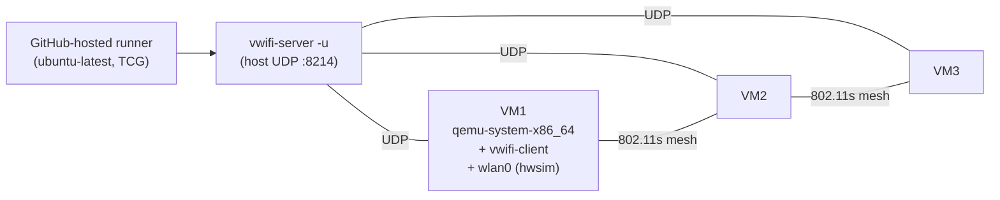

# Follow-up: QEMU + vwifi virtual mesh on CI

## Status

In production on `build-firmware.yml` since April 2026. Two QEMU
jobs run on every PR that touches `packages/`, `tools/ci/`,
`.github/ci/targets.yml`, or `.github/workflows/build-firmware.yml`:

- `test-firmware-qemu-single` — boots one `qemu_x86_64` VM with the
  CI-built image and runs `tests/test_libremesh.py`,
  `tests/test_base.py`, `tests/test_lan.py` against it.
- `test-mesh-qemu` — spawns 3 VMs of the same image, ties them
  through `vwifi-server` so 802.11s-over-mac80211_hwsim forms a
  real mesh on the host loopback, and runs `tests/test_mesh.py`.

Both run on `ubuntu-latest` (no lab time) and complete in ~6-8 min
end-to-end.

## Why this exists

Before this work, every PR triggered the lab self-hosted runner
for hardware tests against three Belkin RT3200, one OpenWrt One,
and one BananaPi BPi-R4. That gave high-fidelity coverage but two
limitations stuck:

1. **Lab availability.** A bench reset, a stuck TFTP server, or
   any of the half-dozen network-fault modes that the testbed has
   exposed over the year would fail every PR until somebody on
   campus power-cycled the bench. There was no automatic
   fallback.
2. **Coverage of the LibreMesh stack itself.** The physical jobs
   only validate "this image boots and reaches an SSH prompt".
   Any test that needs three nodes (`tests/test_mesh.py` —
   batman-adv multi-hop, babeld convergence, batctl orig-table
   propagation) ran exclusively against the lab's two-node bench
   shape (openwrt_one + bpi-r4), which leaves three-hop topologies
   untested.

The QEMU path covers (1) by giving every PR a self-contained
green/red signal that does not depend on lab uptime, and (2) by
making three-node mesh tests a default part of the per-PR run. Lab
hardware tests stay as the higher-fidelity layer (real radios, real
flash, real boot path) but they no longer block the developer loop.

## Architecture



- `vwifi-server` runs on the host and listens for connections from
  every VM's `vwifi-client`. When VM1's `mac80211_hwsim` injects a
  frame onto `wlan0`, the in-guest client forwards it over UDP to
  `vwifi-server`, which broadcasts it to every other connected
  client. Each VM's `mac80211_hwsim` then re-injects the frame on
  its own `wlan0`. Net effect: a soft-radio mesh that batman-adv
  cannot tell apart from a real one.
- The image must contain `kmod-mac80211-hwsim` (virtual radios) +
  `vwifi-client` (forwarding daemon). Both ship in the
  `firmware-qemu_x86_64-<release>.img` artefact built by CI:
  - `kmod-mac80211-hwsim` comes from OpenWrt's official kmods feed
    (no SDK rebuild needed). It just has to be in the per-target
    `packages:` list in `targets.yml`.
  - `vwifi-client` comes from `fcefyn-testbed/vwifi_cli_package`
    declared as `extra_feeds:` for `qemu_x86_64`. This is our org
    fork of `javierbrk/vwifi_cli_package` that adds the
    `PKG_MIRROR_HASH` required by OpenWrt 24.10+ SDK (without it
    `gh-action-sdk` aborts with "Package HASH check failed"). A
    PR to upstream is open; once merged, the `extra_feeds:` URL
    switches back to `javierbrk/vwifi_cli_package`. See
    [`docs/ci/firmware-build.md`](../ci/firmware-build.md#qemu-pipeline-virtual-mesh-build-and-test).

## Pinned versions

Two upstream commits are pinned and have to be bumped together if
anything material changes in the in-guest <-> host wire protocol
between vwifi-client and vwifi-server (the shared C structs in
`csocket.h` are the contract):

| Component | Repo | Pin | Where |
| --- | --- | --- | --- |
| in-guest vwifi-client (OpenWrt package) | `github.com/fcefyn-testbed/vwifi_cli_package` (fork of `javierbrk/`, adds `PKG_MIRROR_HASH`) | `838c44a0611f6de5d2404172a95fcc311c25e95f` | `extra_feeds:` of `qemu_x86_64` in `.github/ci/targets.yml` |
| host vwifi-server (CMake build) | `github.com/Raizo62/vwifi` | `4a9842e6` (= release v7.0, July 2025) | `cache-vwifi-server` and the build step of `test-mesh-qemu` in `.github/workflows/build-firmware.yml` |

Both commits wrap the same upstream daemon source `Raizo62/vwifi@4a9842e6`,
so client and server always speak the same wire protocol. When
upstream `csocket.h` changes, both pins must move together (bump
the `extra_feeds:` SHA in `targets.yml` AND the `vwifi-server-<sha>`
cache key in `build-firmware.yml`).

## Local reproduction

```bash
# Host setup (one-time)
git clone https://github.com/Raizo62/vwifi
cd vwifi && git checkout 4a9842e6
cmake -B build && cmake --build build -j$(nproc)
sudo install -m 0755 build/vwifi-server /usr/local/bin/

# Build the CI image locally — this drops to a vanilla
# `tools/ci/build_image.sh` invocation, same as CI.
cd ~/pi/pi-lime-packages
ARCH=x86_64 \
DEVICE_NAME=qemu_x86_64 \
IMAGE_FORMAT=x86-combined \
BUILD_INITRAMFS=0 \
PACKAGES="<contents of packages_default in targets.yml> kmod-mac80211-hwsim wpad-mesh-mbedtls vwifi" \
tools/ci/build_image.sh x86-64 generic 24.10.6 ./feed-in ./out

# Single-node smoke
cd ~/pi/libremesh-tests
LG_ENV=targets/qemu_x86-64_libremesh.yaml \
  uv run pytest tests/test_libremesh.py --firmware ../pi-lime-packages/out/firmware-qemu_x86_64.img

# Multi-node mesh (3 nodes)
vwifi-server -u &  # leave running in another terminal
LG_VIRTUAL_MESH=1 \
VIRTUAL_MESH_NODES=3 \
VIRTUAL_MESH_IMAGE=$(realpath ../pi-lime-packages/out/firmware-qemu_x86_64.img) \
  uv run pytest tests/test_mesh.py
```

Note that the local image build needs the lime-* IPKs already
present in `feed-in/lime_packages/`. In CI this is the
`build-feed` artifact; locally it is whatever `tools/ci/build_feed.sh`
produced last.

## Known issues / follow-ups

### 1. `pytest_collection_modifyitems` hook in libremesh-tests

The hook in `tests/conftest.py` originally only honoured
`LG_MESH_PLACES`. Without an opt-in for `LG_VIRTUAL_MESH=1`, every
mesh test was skipped on the QEMU job despite a correctly-
provisioned harness. The fix (April 2026):

```python
def pytest_collection_modifyitems(config, items):
    if os.environ.get("LG_MESH_PLACES", "").strip():
        return
    if os.environ.get("LG_VIRTUAL_MESH", "").strip() == "1":
        return
    skip_mesh = pytest.mark.skip(
        reason="Set LG_MESH_PLACES or LG_VIRTUAL_MESH=1 to run multi-node mesh tests",
    )
    for item in items:
        if "mesh" in item.keywords:
            item.add_marker(skip_mesh)
```

Lives in `fcefyn-testbed/libremesh-tests@staging`. Any future
opt-in mechanism for the same hook (e.g. a labgrid-coordinator
URL, or a `pytest.ini` option) needs the same early-return treatment.

### 2. No KVM on GitHub-hosted runners

GitHub's hosted Linux runners do not expose `/dev/kvm`, so QEMU
runs in TCG. Three concurrent VMs at 512 MB each fit fine in the
standard 16 GB hosted runner, but cold boot is ~3-5x slower than
KVM. Concretely, `test-mesh-qemu` takes ~6-8 min on a hosted
runner versus ~2-3 min on a self-hosted KVM box.

When the lab can host a self-hosted runner with `/dev/kvm`
exposed, two changes flip the path to KVM:

1. `runs-on:` of `test-mesh-qemu` (and optionally
   `test-firmware-qemu-single`) goes from `ubuntu-latest` to
   `[self-hosted, qemu-kvm]`.
2. `targets/qemu_x86-64_libremesh.yaml` in libremesh-tests gains
   `enable_kvm: true` on the `QEMUDriver`.

The labgrid env file already passes `cpu: max`, so KVM picks up
the host CPU features automatically.

### 3. lime-packages issue 1180 (default channel 48 / 6 GHz)

LibreMesh's default `wifi config` writes `channel=48` to every
radio it discovers. `mac80211_hwsim`'s default radio caps include
6 GHz, and `wpad-mesh-mbedtls` then refuses to bring up an
802.11s mesh on a non-DFS 6 GHz channel without a proper
regulatory database lookup — which the in-guest LibreMesh image
does not perform. This manifests as `wlan0` staying down with
`hostapd_logger: STATE-MACHINE: Configuration error` in dmesg.

Worked around in CI today by relying on `iw dev wlan0 mesh join
LiMe freq 2437` in
[`fork-libremesh-virtual-mesh/start-mesh-no-tmux.sh`](../../../fork-libremesh-virtual-mesh/start-mesh-no-tmux.sh)
and the equivalent path in
`virtual_mesh_launcher.launch_virtual_mesh()` — both override the
default channel to 2.4 GHz (channel 6) before bringing up the
radios. Once
[`libremesh/lime-packages#1180`](https://github.com/libremesh/lime-packages/issues/1180)
is closed (or the QEMU profile ships `lime-defaults` with a
channel ≤ 13), this workaround can go away.

### 4. Boot timeout tuning

`virtual_mesh_launcher.launch_virtual_mesh()` defaults to
`VIRTUAL_MESH_BOOT_TIMEOUT=180s` per VM. On TCG that is ~tight;
we have not yet observed a CI-time flake, but a slow runner could
trip it. The launcher already accepts an env var override; if
flakiness shows up in `test-mesh-qemu` results, the first knob to
turn is `VIRTUAL_MESH_BOOT_TIMEOUT=300` in the workflow step.

### 5. Image size

The combined image is currently ~25 MB compressed (~75 MB raw),
which fits inside GitHub Actions' artefact size limits comfortably
but adds a noticeable upload step on the build runner. If the
artefact starts pushing 200+ MB (e.g. once we ship a non-mini
LibreMesh package set on x86_64), consider switching to
`actions/upload-artifact`'s `compression-level` or splitting the
manifest sidecar into a separate artefact.

### 6. 25.12.2 not yet exercised in QEMU

OpenWrt 25.12 switched the package index format from OPKG to APK,
and the SDK config step has separate problems on top of that
(recursive Kconfig deps, `iproute2` clean-build/compile loop). See
[`openwrt_25_12_build_issues.md`](openwrt_25_12_build_issues.md)
for the full diagnosis. The `qemu_x86_64` target IS in the matrix
for both 24.10.6 and 25.12.2, so the 25.12.2 cell currently fails
at `build-feed` time — `fail-fast: false` keeps the 24.10.6 run
going, and `timeout-minutes: 90` on `build-feed` caps the wasted
runner time. The QEMU jobs only fire when the corresponding
`firmware-qemu_x86_64-<release>` artefact exists, so a
build-failed 25.12.2 cell silently skips its QEMU test cells
without misleading green ticks.
