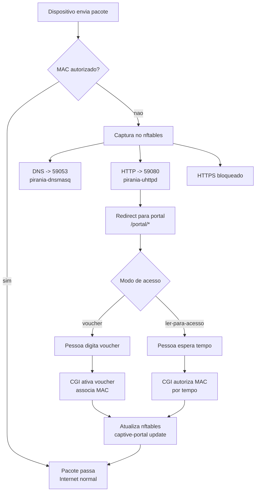

# Pirania: como funciona (bem simples)

Este texto explica o Pirania como se fosse para uma crianca pequena, mas sem perder o caminho real das pecas do sistema.

## A ideia geral (bem simples)

Pense no Pirania como um **porteiro** de um predio:

- Se voce **nao tem permissao**, o porteiro te leva para a recepcao (o portal).
- La voce **mostra seu voucher** ou **espera um tempinho** (ler-para-acesso).
- Depois disso, o porteiro **coloca seu nome na lista** e voce pode entrar.

## As pecas principais (quem faz o que)

- **Capturador de trafego (nftables)**: o porteiro que decide quem pode passar.
- **DNS local (pirania-dnsmasq)**: o guia que responde “o portal fica aqui”.
- **Redirecionador HTTP (pirania-uhttpd + redirect)**: o guia que aponta a porta certa.
- **Portal (paginas em /www/portal/)**: o lugar onde a pessoa digita o voucher ou espera o tempo.
- **CGI handlers**: os ajudantes que escrevem na lista de permitidos.
- **Banco de vouchers (arquivos JSON)**: a caixinha onde os vouchers ficam guardados.
- **Lista de MACs autorizados**: a lista que libera os dispositivos.

## Fluxo de um pacote (o que acontece quando um pacote chega)

1. **Chega um pacote do dispositivo da pessoa**.
2. O **nftables** pergunta: “Esse MAC esta autorizado?”
3. Se **nao** estiver autorizado:
   - DNS vai para **porta 59053** (pirania-dnsmasq).
   - HTTP vai para **porta 59080** (pirania-uhttpd).
   - HTTPS e bloqueado.
4. O **pirania-uhttpd** redireciona a pessoa para o portal.
5. A pessoa **digita o voucher** ou **espera o tempo**.
6. O CGI **autoriza o MAC**.
7. O Pirania **atualiza o nftables**.
8. O proximo pacote **passa normalmente**.

## Diagrama Mermaid (fluxo simples)

## O mesmo fluxo, so que com palavras super simples

- O Pirania olha quem chegou.
- Se a pessoa **nao esta na lista**, ele mostra o portal.
- A pessoa faz a “tarefa” (voucher ou esperar).
- O Pirania coloca o MAC na lista.
- Pronto: agora o acesso passa livre.

## Diferencas entre os dois modos

- **Voucher**: precisa de um codigo. O MAC fica autorizado enquanto o voucher estiver ativo.
- **Ler-para-acesso**: so espera um tempo. O MAC fica autorizado por alguns minutos.

## Onde cada parte vive no projeto (referencia)

- Captura de trafego: `packages/pirania/files/usr/bin/captive-portal`
- DNS local: `packages/pirania/files/etc/init.d/pirania-dnsmasq`
- Redirect HTTP: `packages/pirania/files/etc/init.d/pirania-uhttpd`
- Script de redirect: `packages/pirania/files/www/pirania-redirect/redirect`
- Portal (paginas): `packages/pirania/files/www/portal/`
- CGI handlers:
  - `packages/pirania/files/www/cgi-bin/pirania/preactivate_voucher`
  - `packages/pirania/files/www/cgi-bin/pirania/activate_voucher`
  - `packages/pirania/files/www/cgi-bin/pirania/authorize_mac`
- Logica de vouchers: `packages/pirania/files/usr/lib/lua/voucher/`
- Logica ler-para-acesso: `packages/pirania/files/usr/lib/lua/read_for_access/`

---

Se quiser, posso adicionar um diagrama mais tecnico (com portas, processos e arquivos) ou um diagrama separado so para o modo voucher.
